Hello, this guide explains how to use the **Bulk Product Editor extension for PrestaShop**  (old name is Sync Products data Google Sheet Prestahop (327186511080). This extension operates through Google Sheets, and its main purpose is to synchronize product information between Google Sheets and PrestaShop.
https://daihungpham.tech/?page_id=160

## Test environment on Prestashop

You have the option to limit your database access permissions or create a new API key in the 'Advanced Parameters > Webservice' section of PrestaShop. For this scenario, I have prepared a key set to allow GET, PUT, POST, and PATCH operations for all information in my database.
For more comprehensive details, you can refer to the PrestaShop developer documentation.
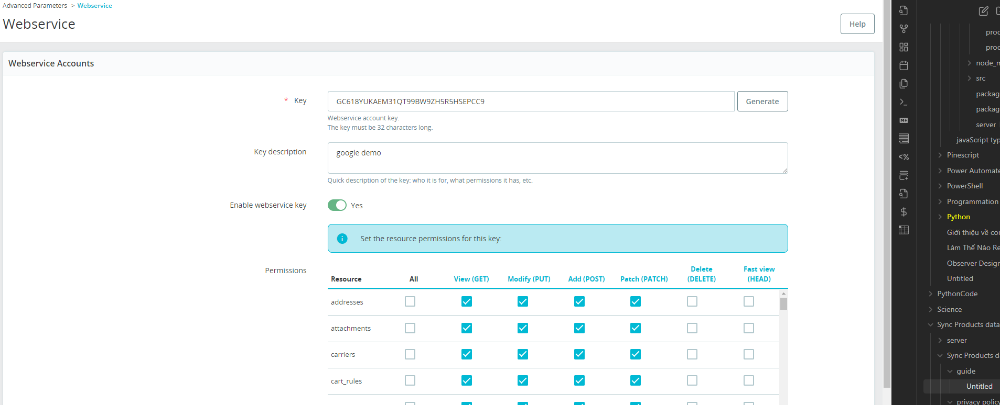

I have created an API key for you on the PrestaShop web service. This key enables you to access the API service for communication with PrestaShop.

## Install environment on Google Sheets. 

https://docs.google.com/spreadsheets/d/1iASz3aeBtZggfLrFEFqvOBlUZ2k5iXLIq58v6O6aiT0/edit
On this spreadsheet, you have 3 sheets:
`_CONFIG_` 
`_PRODUCTS_`
`_FILTER_`

(I have configured this for the test environment.)

----------------

# OPERATION:

1) Find the items you need to edit on sheet  `_FILTER_`

This sheet is designed to filter items in your database. You can use it to find the items you need to edit.

Search by Name: Find items that include 'cushion' in their name.

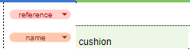

To find all items, use the '%' symbol in the search query.
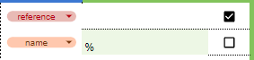

click to button "`filter ID prestashop`" for get list items

Click the '`Get Data PrestaShop`' button to retrieve information about these items. This information corresponds to the current items in the database.

details of the items will appear in columns F through L.
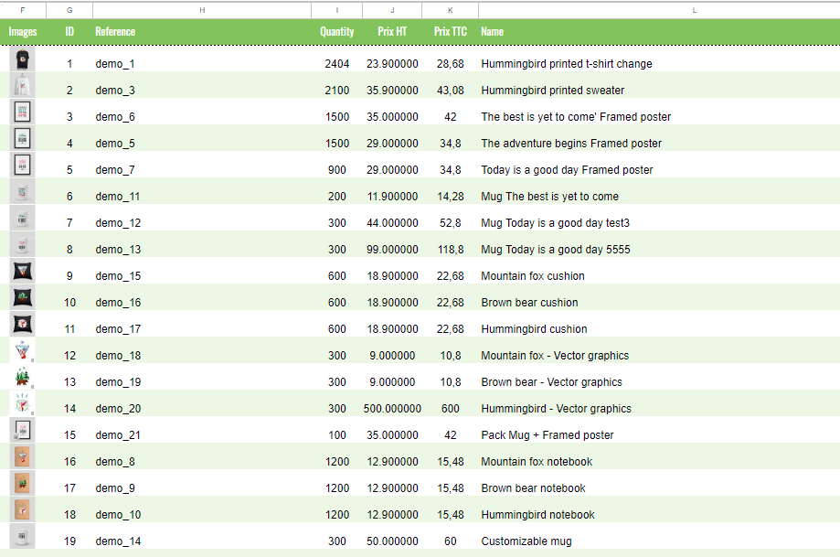

2) Edit items on sheet `_PRODUCTS_`
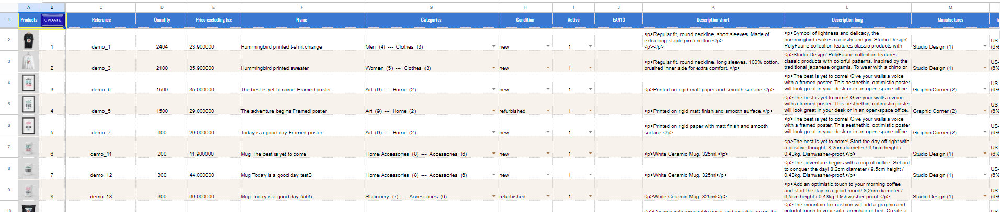

After retrieving the item information on the `_FILTER_` sheet, you can edit any product information on the `_PRODUCTS_` sheet.

Reference	
Quantity	
Price excluding tax	
Name	
Categories	
Condition	
Active	
EAN13	
Description short	
Description long	
Manufactures	
Tax rules group

In my case i wanna change:

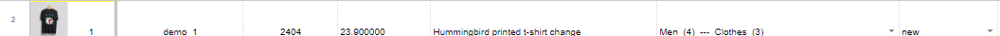
to
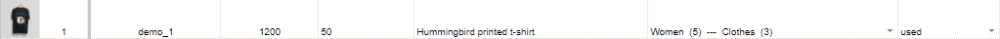

click on button `UPDATE` on B1 cell for update information
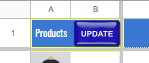

Update Result is write on O column:
`Product 1 quantity updated successfully! (2404 -> 1200)Product 1 price updated successfully! (23.900000 -> 50)Product 1 name updated successfully! (Hummingbird printed t-shirt change -> Hummingbird printed t-shirt )Product 1 category updated successfully! (4 -> 5)Product 1 condition updated successfully! (new -> used)`

You can verify on PrestaShop that the item has been updated with the new information.

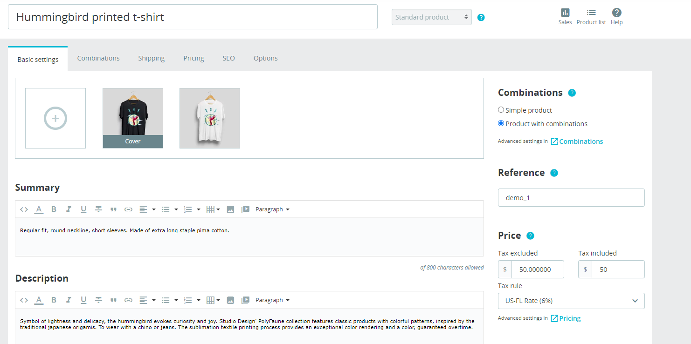
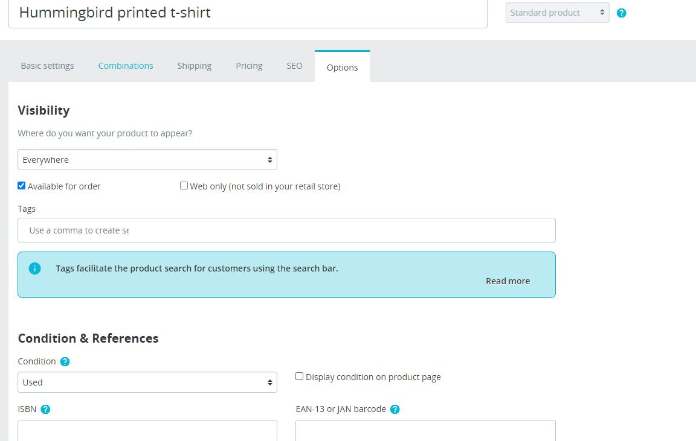

The purpose of this extension is to facilitate faster editing of item information on PrestaShop. By utilizing the functions of Google Sheets, it enables collaborative work, allowing all team members to edit information in the same place in real-time. Additionally, Google Sheets has a history function that provides backup for edited information in case of errors.

## POLITIQUE DE CONFIDENTIALITÉ - FREE USE EXTENSION PRIVACY POLICY
https://daihungpham.tech/?page_id=612
Data Practices with Google User Data

Access: We access data on Google Sheets™ for enabling communication between the user’s PrestaShop™ server and their spreadsheet.
Use: The data is solely used to facilitate this communication between the user’s PrestaShop™ server and their spreadsheet.
Storage: The Extension does not retain or store any user data.
Sharing: No user data is shared, sold, or transferred to any third parties.

---------------------

# Run on a Client's Different PrestaShop Site

- This is the configuration sheet. You can change the PrestaShop site information in cells B1:B2, which contain the address of the PrestaShop test site and the API Web Service key. An account for testing is entered in cells B3:B4.
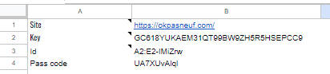

- **New Clients or Additional PrestaShop Sites**: If you are a new client or wish to use this for another PrestaShop site, simply duplicate my google spreadsheet page and register a new ID and passcode on my site at [daihungpham.tech](https://daihungpham.tech/?page_id=182). The ID and passcode registered will work for the PrestaShop site you choose to register.
- **Account Requests**: You can request an account as many times as you like; there is no limit. The purpose of this page is to eventually run Google ads (on the futur). When users request an account (providing 300 credits for editing 300 items), they will need to view Google ads beforehand. This approach is necessary to generate revenue and maintain the application for free users.
- **Ad-Free Option**: If someone prefers not to see ads or requires additional options, they can contact customer service at [daihungpham.tech](https://daihungpham.tech/) to request a personalized version for their enterprise. This version includes no account requirements and no ads."

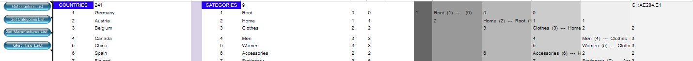
`Get countries List`
`Get Categories List`
`Get Manufactures List`
`Get Tax List`
There are buttons for updating information about countries, categories, manufacturers, and taxes on PrestaShop. 
These options are necessary when you have edited or added more information about countries, categories, manufacturers, or taxes in PrestaShop. Alternatively, if you need to run for other sites, you will need to update the information to ensure it corresponds with the new site.
For example, if you want to update the manufacturers' information, you should delete the contents of columns AA:AB and then click on 'Get Manufacturers List' to refresh the information about manufacturers.
